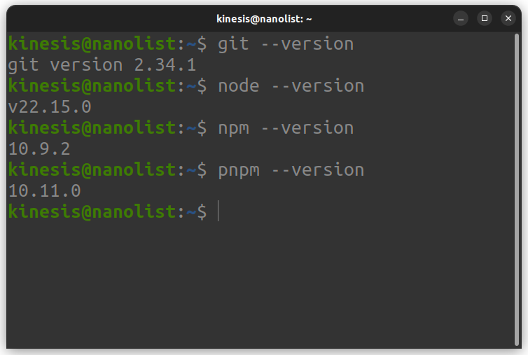
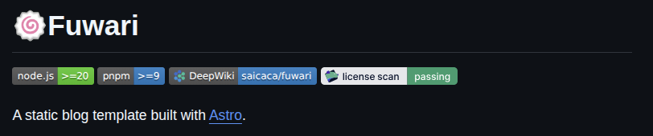
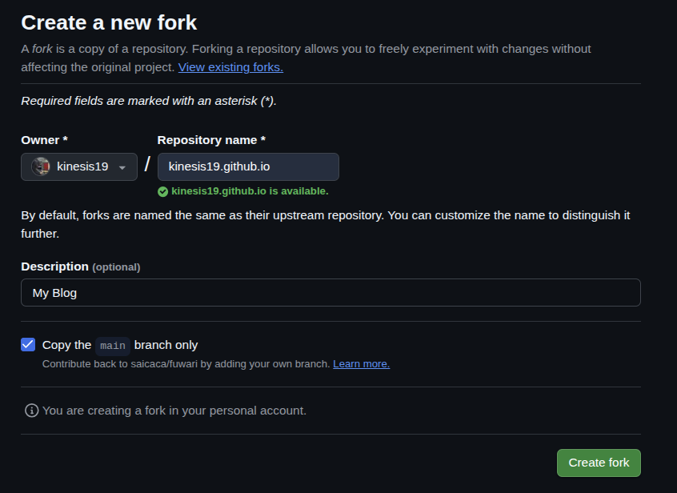
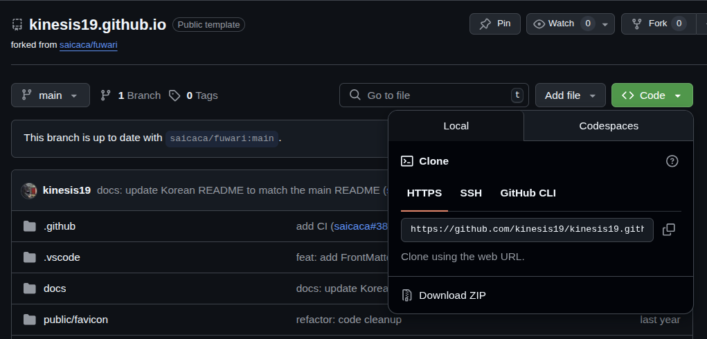
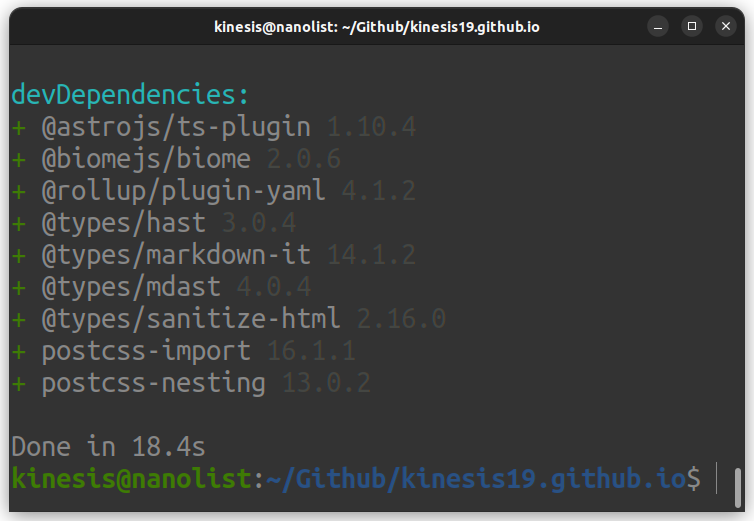
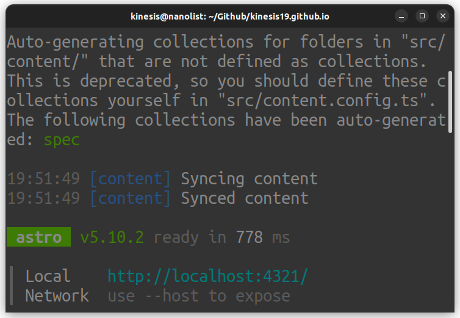
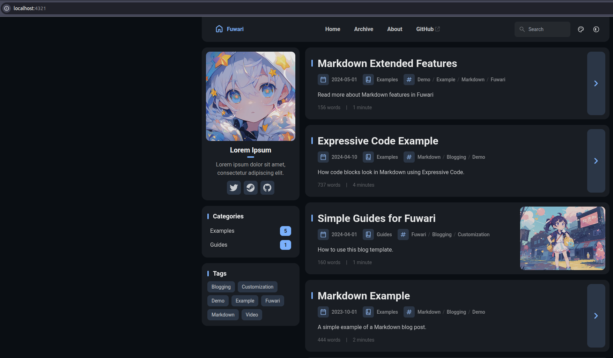

# 작업 환경
- Ubuntu 22.04

# 1단계: 개발 환경 준비 및 Fuwari 템플릿 설치
## 1.1. 프로그램 설치
- Git: 소스 코드를 관리하고 Github와 연동하기 위한 필수 프로그램입니다.
- Node.js: Astro 프로젝트를 실행하기 위한 JavaScript 런타임환경입니다. LTS(Long-Term-Support) 버전을 설치합니다.
    - [Node.js 공식 홈페이지](https://nodejs.org/ko/download)에서 LTS 버전을 다운로드하여 설치합니다. (2025년 7월 14일 기준 v20 이상의 버전을 사용해야 합니다.)
- pnpm: Fuwari 템플릿을 사용하기 위해 필요한 패키지 관리자입니다.
    - [pnpm 공식 홈페이지](https://pnpm.io/ko/installation)에서 자신의 운영체제에 맞는 버전을 다운로드하여 설치합니다.
    (2025년 7월 14일 기준 v9 이상의 버전을 사용해야 합니다.)

설치 확인은 terminator에서 다음 명령어를 입력하여 버전 정보가 나오는지 확인합니다.
```bash
git --version
node --version
npm --version
pnpm --version
```


이후 [Fuwari 공식 README.md](https://github.com/saicaca/fuwari/blob/main/README.md)에서 명시된 버전을 준수하였는지 확인합니다.


## 1.2. Fuwari 템플릿 fork & run
[Fuwari 공식 repository](https://github.com/saicaca/fuwari)에서 우측 상단에 있는 `Fork` 버튼을 클릭합니다.

- `Repository name`: 생성할 repository(저장소)의 이름입니다. Github에서 Github Pages 기능을 제공하기에 `<username>.github.io` 형식으로 설정하는 것을 추천합니다.

- `Description`: repository의 설명을 작성합니다.

모든 설정을 완료했다면, 좌측 하단에 있는 `Create fork` 버튼을 클릭합니다.


fork한 repository에서 `Code` 버튼을 클릭하고, 현재 repository의 Web URL을 복사합니다.

복사한 URL은 다음과 같은 형식으로 구성되어 있습니다.
```bash
https://github.com/kinesis19/kinesis19.github.io.git
```

Terminator을 실행하고, fork한 repository를 clone하고, 해당 경로로 진입합니다.
```bash
git clone https://github.com/kinesis19/kinesis19.github.io.git # clone
cd kinesis19.github.io # 경로 진입
```

이후, 블로그 개발에 필요한 라이브러리(패키지)들을 설치합니다.
```bash
pnpm install
```


로컬 개발 서버를 시작합니다.
```bash
pnpm dev
```



화면에 나타난 Local address를 `Ctrl + Left Click` 혹은 인터넷 브라우저에 입력하여 진입합니다.

정상적으로 개발 환경이 구축된 것을 알 수 있습니다.

