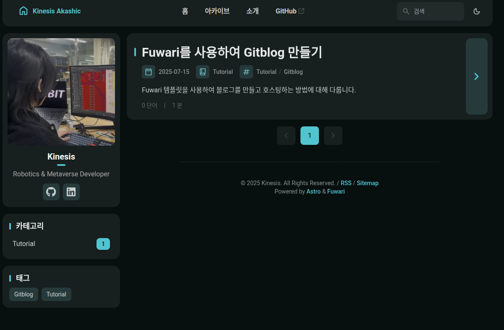
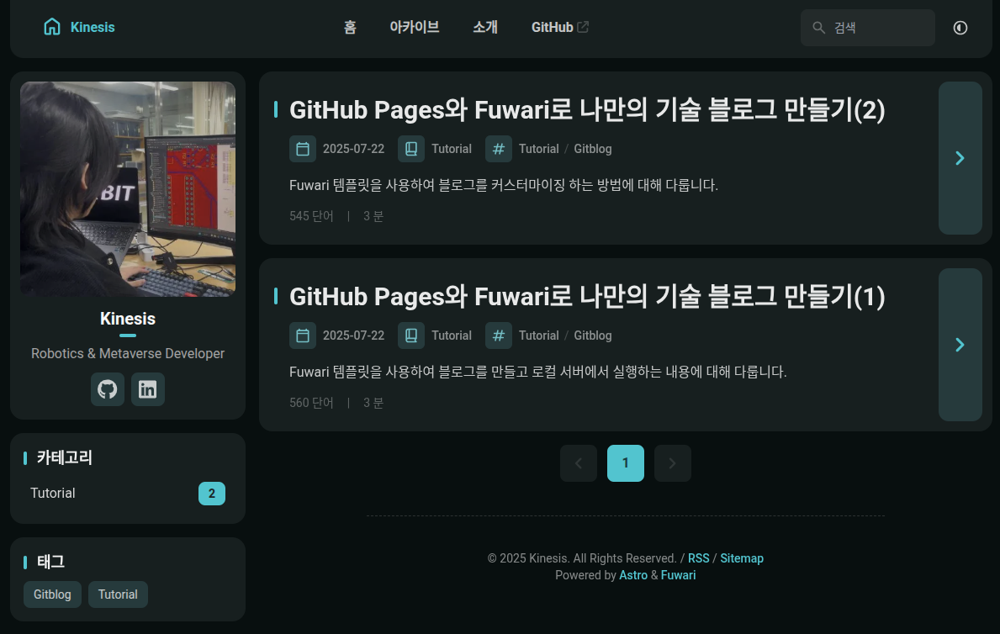
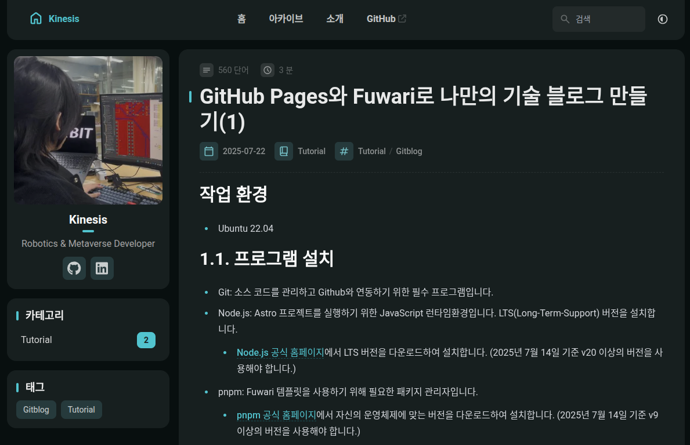

# 작업 환경
- Ubuntu 22.04

# 2단계: 블로그 커스터마이징 및 콘텐츠 작성하기
## 2.1. 블로그 커스터마이징하기
가장 먼저 블로그의 이름, 설명, 작성자 정보 등을 수정합니다. 대부분의 설정은 `src/config.ts` 파일에서 관리됩니다.

아래와 같이 정보를 수정합니다.

```ts
export const siteConfig: SiteConfig = {
	title: "Kinesis Akashic",
	subtitle: "Datadoll Studio",
	lang: "ko", // 'en', 'zh_CN', 'zh_TW', 'ja', 'ko', 'es', 'th'
	themeColor: {
		hue: 250, // Default hue for the theme color, from 0 to 360. e.g. red: 0, teal: 200, cyan: 250, pink: 345
		fixed: false, // Hide the theme color picker for visitors
	},
	banner: {
		enable: false,
		src: "assets/images/demo-banner.png", // Relative to the /src directory. Relative to the /public directory if it starts with '/'
		position: "center", // Equivalent to object-position, only supports 'top', 'center', 'bottom'. 'center' by default
		credit: {
			enable: false, // Display the credit text of the banner image
			text: "", // Credit text to be displayed
			url: "", // (Optional) URL link to the original artwork or artist's page
		},
	},
	toc: {
		enable: true, // Display the table of contents on the right side of the post
		depth: 2, // Maximum heading depth to show in the table, from 1 to 3
	},
	favicon: [
		// Leave this array empty to use the default favicon
		// {
		//   src: '/favicon/icon.png',    // Path of the favicon, relative to the /public directory
		//   theme: 'light',              // (Optional) Either 'light' or 'dark', set only if you have different favicons for light and dark mode
		//   sizes: '32x32',              // (Optional) Size of the favicon, set only if you have favicons of different sizes
		// }
	],
};
```

어느정도 수정을 완료하였습니다.




이제 사이트를 정상적으로 배포하기 위한 설정을 진행합니다.
`astro.config.mjs` 파일을 다음과 같이 수정합니다.
- `site`: 도메인 주소(https://<userid>.github.io)

```javascript
// https://astro.build/config
export default defineConfig({
	site: "https://kinesis19.github.io",
	base: "/",
	trailingSlash: "always",
	integrations: [
		tailwind({
			nesting: true,
		}),
```

이후, `.github` -> `workflows` 에 진입하여 `deploy.yml` 파일을 생성합니다.

공식문서: [configure-a-github-action](https://docs.astro.build/en/guides/deploy/github/#configure-a-github-action)

공식 문서에저 제공하는 `deploy.yml` 코드를 복사하여 붙여넣거나 하단에 있는 코드를 복사하여 붙여 넣습니다. (나중에 Github Pages에서 build를 하게 되는데, deploy.yml의 format의 이슈로 하단과 같이 수정하였습니다.)
```yaml
name: Deploy to GitHub Pages

on:
  push:
    branches: [ main ]
  workflow_dispatch:

permissions:
  contents: read
  pages: write
  id-token: write

jobs:
  build:
    runs-on: ubuntu-latest
    steps:
      - name: Checkout your repository using git
        uses: actions/checkout@v4
      - name: Install, build, and upload your site
        uses: withastro/action@v3

  deploy:
    needs: build
    runs-on: ubuntu-latest
    environment:
      name: github-pages
      url: ${{ steps.deployment.outputs.page_url }}
    steps:
      - name: Deploy to GitHub Pages
        id: deployment
        uses: actions/deploy-pages@v4
```

## 2.2. 콘텐츠 작성하기
콘텐츠는 마크다운 문법으로 작성할 수 있습니다. Fuwari에서는 마크다운 문법 외에도 다양한 기능을 제공하고 있으니 적절하게 응용하여 콘텐츠 내용을 작성할 수 있습니다.

콘텐츠 작성 예시: [Simple Guides for Fuwari](https://fuwari.vercel.app/posts/guide/)

작성을 완료하면 다음과 같이 나타납니다.



