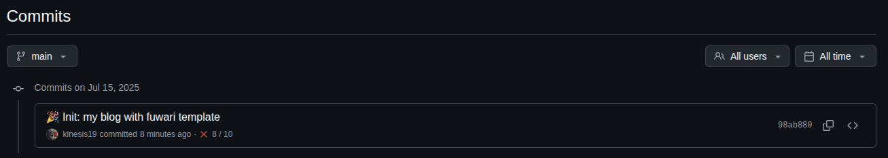
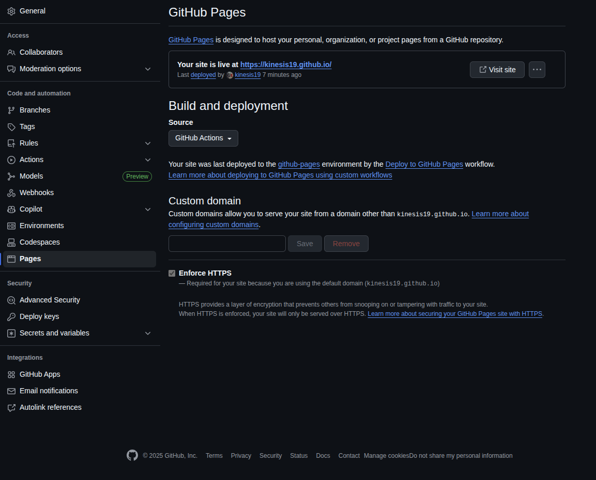
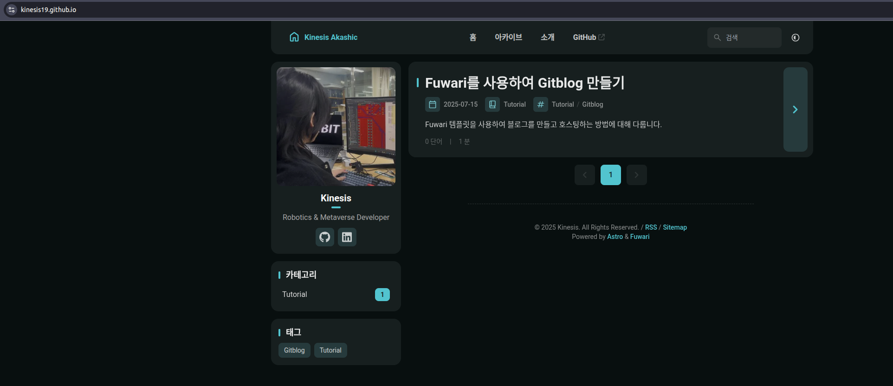

# 작업 환경
- Ubuntu 22.04

# 3단계: Github Pages로 배포하기
## 3.1. 사이트 구축하기
이제 프로덕션 사이트를 구축합니다.

```bash
pnpm build # ./dist/에 프로덕션 사이트 구축
pnpm preview # 배포하기 전, 로컬에서 빌드 미리보기
```

## 3.2. 사이트 배포하기
이후 정상적으로 빌드가 완료되면 origin에 반영해줍니다.
```bash
git add .
git commit -m ":tada: Init: my blog with fuwari template"
git push
```

이후, commit log를 보면 build가 정상적으로 안 된 것을 알 수 있습니다.


repository `Settings` -> `Pages` -> `Build and deployment` 항목의 `Source`를 `Github Actions` 로 설정합니다.


설정을 완료하고, `Actions` 으로 돌아와서 실패한 build 로그에 진입하여 `Re-run jobs` 버튼을 클릭합니다. 이후, `deploy.yml` 파일을 수정합니다. 주석을 제거하고, 들여쓰기 등을 수정한 이후에 다시 commit * push를 진행하면 정상적으로 배포가 되는 것을 확인할 수 있습니다.

:::note
[2단계 블로그](https://blog.kashic.dev/posts/how-to-make-gitblog-tutorial-2/#:~:text=%EA%B3%B5%EC%8B%9D%20%EB%AC%B8%EC%84%9C%EC%97%90%EC%A0%80%20%EC%A0%9C%EA%B3%B5%ED%95%98%EB%8A%94%20deploy.yml%20%EC%BD%94%EB%93%9C%EB%A5%BC%20%EB%B3%B5%EC%82%AC%ED%95%98%EC%97%AC%20%EB%B6%99%EC%97%AC%EB%84%A3%EA%B1%B0%EB%82%98%20%ED%95%98%EB%8B%A8%EC%97%90%20%EC%9E%88%EB%8A%94%20%EC%BD%94%EB%93%9C%EB%A5%BC%20%EB%B3%B5%EC%82%AC%ED%95%98%EC%97%AC%20%EB%B6%99%EC%97%AC%20%EB%84%A3%EC%8A%B5%EB%8B%88%EB%8B%A4.%20(%EB%82%98%EC%A4%91%EC%97%90%20Github%20Pages%EC%97%90%EC%84%9C%20build%EB%A5%BC%20%ED%95%98%EA%B2%8C%20%EB%90%98%EB%8A%94%EB%8D%B0%2C%20deploy.yml%EC%9D%98%20format%EC%9D%98%20%EC%9D%B4%EC%8A%88%EB%A1%9C%20%ED%95%98%EB%8B%A8%EA%B3%BC%20%EA%B0%99%EC%9D%B4%20%EC%88%98%EC%A0%95%ED%95%98%EC%98%80%EC%8A%B5%EB%8B%88%EB%8B%A4.))에서 제공한 yaml 코드를 복사해서 적용했다면 별도로 deploy.yml를 수정하지 않아도 됩니다.
:::


```yaml
name: Deploy to GitHub Pages

on:
  push:
    branches: [ main ]
  workflow_dispatch:

permissions:
  contents: read
  pages: write
  id-token: write

jobs:
  build:
    runs-on: ubuntu-latest
    steps:
      - name: Checkout your repository using git
        uses: actions/checkout@v4
      - name: Install, build, and upload your site
        uses: withastro/action@v3

  deploy:
    needs: build
    runs-on: ubuntu-latest
    environment:
      name: github-pages
      url: ${{ steps.deployment.outputs.page_url }}
    steps:
      - name: Deploy to GitHub Pages
        id: deployment
        uses: actions/deploy-pages@v4
```

정상적으로 배포가 완료된 것을 확인할 수 있습니다.


