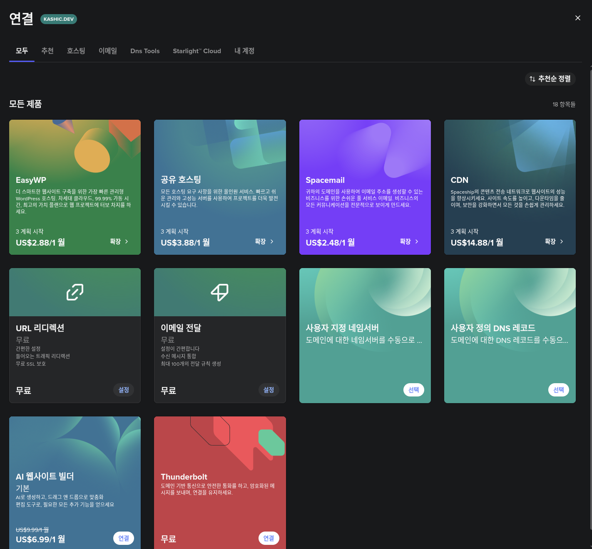
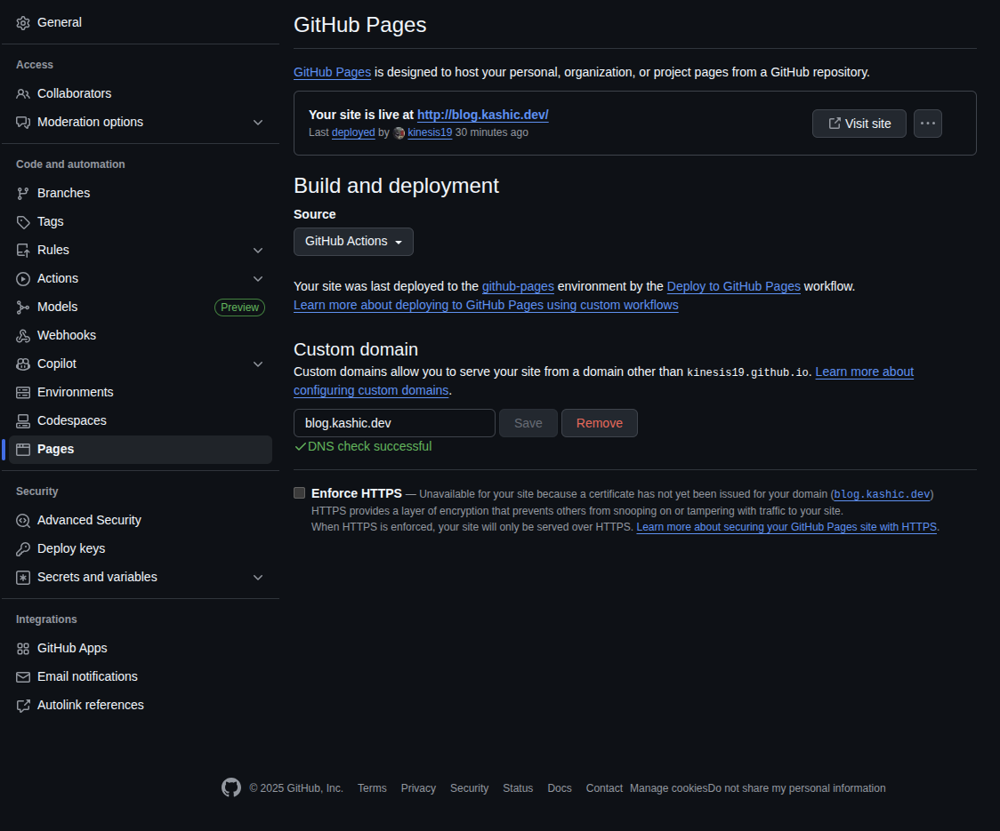

# 작업 환경
- Ubuntu 22.04

# 4단계: 개인 도메인 연결하기
이제 개인 도메인을 연결하는 방법에 대해 알아보겠습니다.
`spaceship` 업체로부터 도메인을 구입하여 사용하고 있습니다.

우측에 있는 `연결 `버튼을 클릭합니다.

이후, `사용자 정의 DNS 레코드` 항목을 선택하여 추가합니다.

`레코드 추가` -> `CNAME` 을 선택합니다.
호스트는 blog, 값으로는 github pages 주소를 입력합니다.

이후 `Github Pages` 에서 `Custom domain` 을 수정해주면 정상적으로 반영됩니다.

