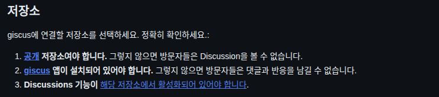
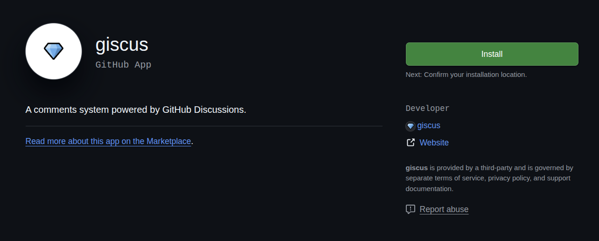
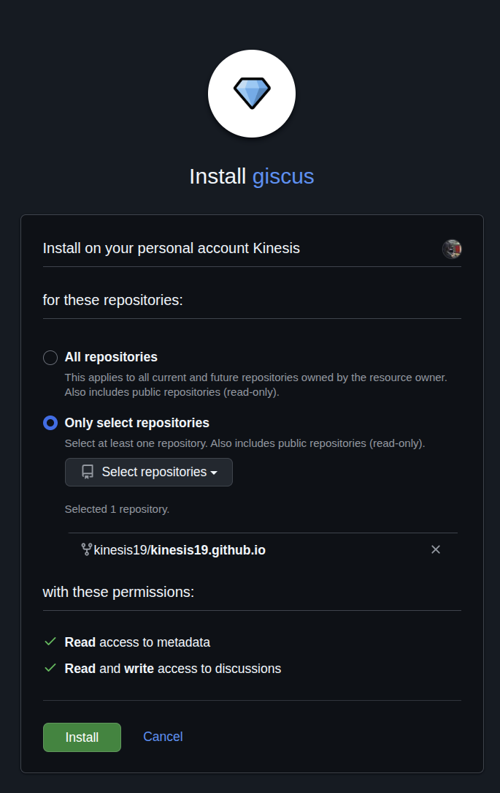
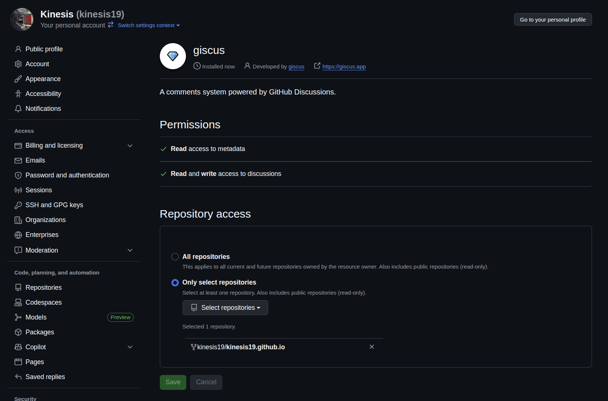
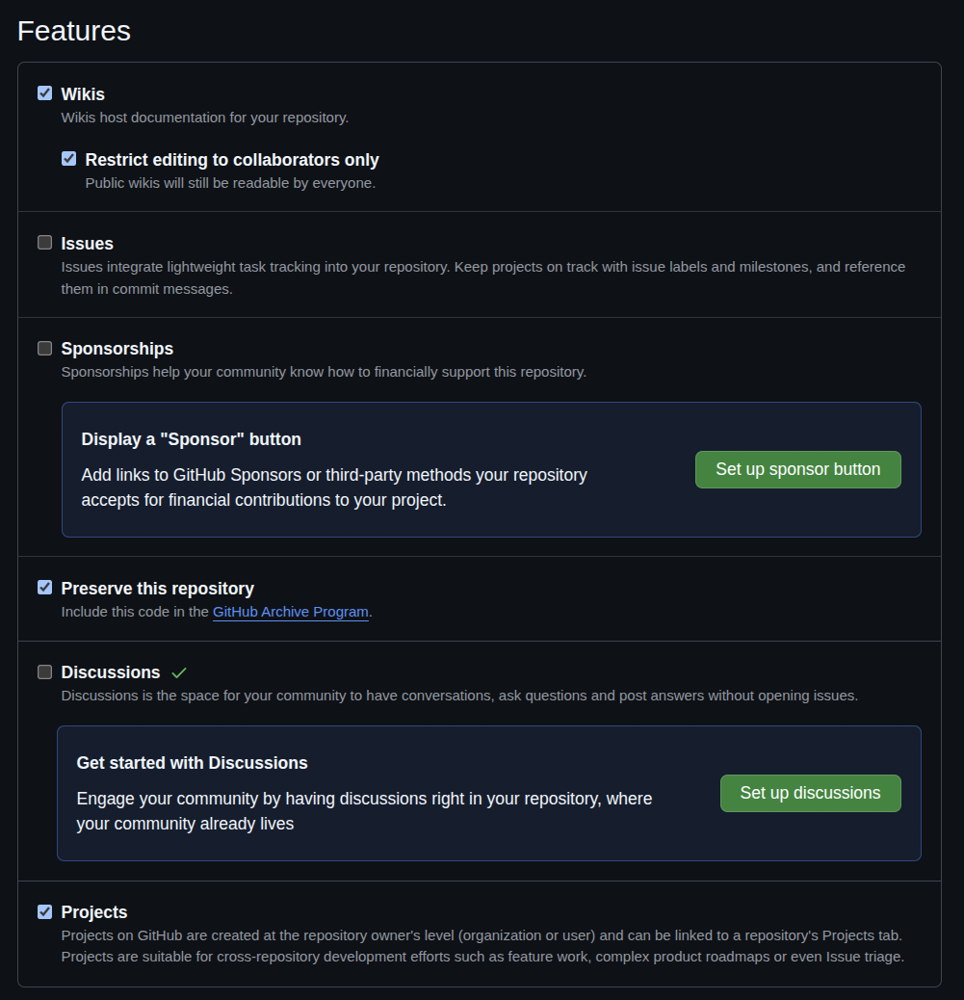
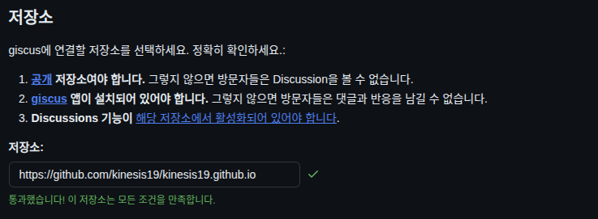
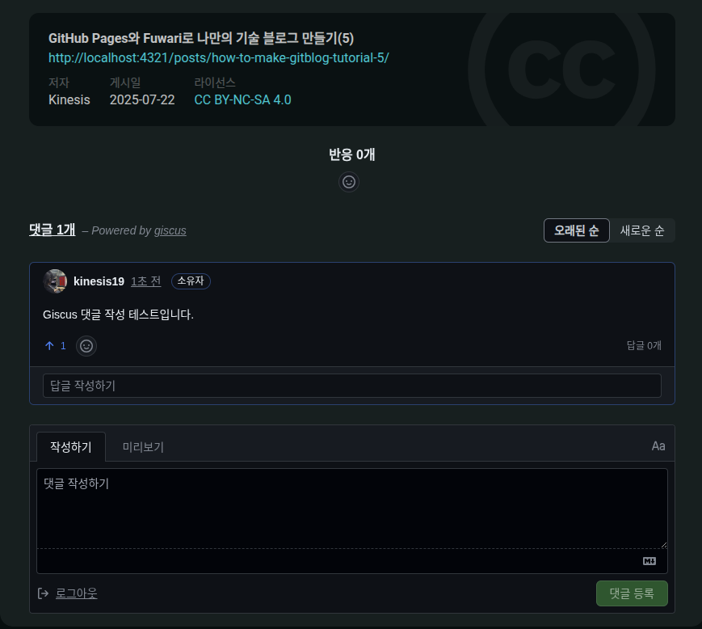

# 작업 환경
- Ubuntu 22.04

# 5단계: 댓글 기능 추가하기
다양한 서드파티 중에 [Giscus](https://giscus.app/ko)를 사용해서 댓글 기능을 추가하겠습니다. 

## 5.1. Giscus 서드파티 추가하기
먼저 Giscus를 추가하기 위한 조건을 확인합니다.


1번째 조건은 이미 충족 되었으니, 2번째 조건인 Giscus를 설치합니다.
[Giscus 설치하기](https://github.com/apps/giscus)

`Install` 버튼을 클릭합니다.


이후, `Only select repositories`를 선택하고, blog로 사용하고 있는 repository를 할당합니다.



정상적으로 추가된 것을 알 수 있습니다.



이후 repository의 settings에 들어가서 `Discussions` -> `Set up discussions`를 클릭합니다.



우측 하단에 있는 `Start discussion` 버튼을 클릭하고, `Start discussion` 버튼을 클릭해서 설정해 주면 됩니다.

다시 [Giscus 설정 페이지](https://giscus.app/ko)로 돌아와서 저장소 주소를 할당합니다.



## 5.2. 블로그에 Giscus 추가하기

그대로 사용해도 되고, 취향껏 커스터마이징을 진행합니다. 하단에 생성된 Giscus 관련 `<script>` 관련 코드를 복사합니다.

그 다음에 repository의 `src/components/` 경로에서 `Giscus.astro` 파일을 하나 추가합니다. 이후, Giscus 페이지에서 복사한 `<script>` 코드를 다음과 같이 붙여 넣습니다.

```astro
---
// src/components/Giscus.astro
---
<div class="giscus-container">
    <script src="https://giscus.app/client.js"
        data-repo="kinesis19/kinesis19.github.io"
        data-repo-id="R_kgDOPMN3mw"
        data-category="General"
        data-category-id="DIC_kwDOPMN3m84CtQ1D"
        data-mapping="pathname"
        data-strict="0"
        data-reactions-enabled="1"
        data-emit-metadata="0"
        data-input-position="bottom"
        data-theme="preferred_color_scheme"
        data-lang="ko"
        crossorigin="anonymous"
        async
    >
    </script>
</div>
```

이후 `pages/posts/` 경로에 있는 `[...slug].astro` 파일의 코드를 수정합니다.

1. import문 추가
```astro
---
// pages/posts/[...slug].astro
---
import path from "node:path";
import License from "@components/misc/License.astro";
import Markdown from "@components/misc/Markdown.astro";
import I18nKey from "@i18n/i18nKey";
import { i18n } from "@i18n/translation";
import MainGridLayout from "@layouts/MainGridLayout.astro";
import { getSortedPosts } from "@utils/content-utils";
import { getDir, getPostUrlBySlug } from "@utils/url-utils";
import { Icon } from "astro-icon/components";
import { licenseConfig } from "src/config";
// 아래와 같이 Giscus import
import Giscus from "../../components/Giscus.astro";
import ImageWrapper from "../../components/misc/ImageWrapper.astro";
import PostMetadata from "../../components/PostMeta.astro";
import { profileConfig, siteConfig } from "../../config";
import { formatDateToYYYYMMDD } from "../../utils/date-utils";
```


2. Giscus 태그 추가
```astro
            <Markdown class="mb-6 markdown-content onload-animation">
                <Content />
            </Markdown>

            {licenseConfig.enable && <License title={entry.data.title} slug={entry.slug} pubDate={entry.data.published} class="mb-6 rounded-xl license-container onload-animation"></License>}
            <!-- Add Giscus -->
            <Giscus />

        </div>
    </div>
```

수정한 내용을 저장하고 local 서버를 실행하면, 정상적으로 반영된 것을 알 수 있습니다.


# Trouble Shooting
## T1. Run Biome issue
```txt
Run biome ci ./src --reporter=github
  biome ci ./src --reporter=github
  shell: /usr/bin/bash -e {0}
Error: The imports and exports are not sorted.
ci ━━━━━━━━━━━━━━━━━━━━━━━━━━━━━━━━━━━━━━━━━━━━━━━━━━━━━━━━━━━━━━━━━━━━━━━━━━━━━━━━━━━━━━━━━━━━━━━━━

  × Some errors were emitted while running checks.
  

Error: File content differs from formatting output
Error: Process completed with exit code 1.
```

위와 같이 Run biome 관련해서 build 실패가 확인되면 다음 명령어를 통해 해결하고, 다시 push하면 정상적으로 build 됩니다.

```bash
pnpm run lint
```

